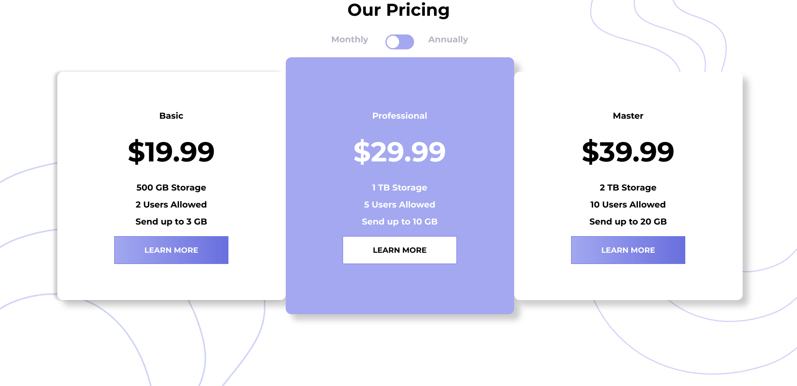
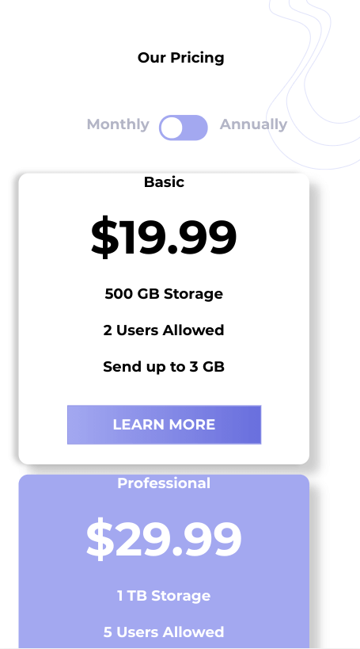

# Frontend Mentor - Pricing component with toggle solution

This is a solution to the [Pricing component with toggle challenge on Frontend Mentor](https://www.frontendmentor.io/challenges/pricing-component-with-toggle-8vPwRMIC). Frontend Mentor challenges help you improve your coding skills by building realistic projects.

## Table of contents

- [Overview](#overview)
  - [The challenge](#the-challenge)
  - [Screenshot](#screenshot)
  - [Links](#links)
- [My process](#my-process)
  - [Built with](#built-with)
  - [What I learned](#what-i-learned)
  - [Continued development](#continued-development)
  - [Useful resources](#useful-resources)

## Overview

### The challenge

Users should be able to:

- View the optimal layout for the component depending on their device's screen size
- Control the toggle with both their mouse/trackpad and their keyboard
- **Bonus**: Complete the challenge with just HTML and CSS

### Screenshot

### Links

- Live Site URL: [Github Pages](https://jdegand.github.io/pricing-component-with-toggle/)

## My process

### Built with

- No Javascript
- CSS custom properties
- Flexbox
- CSS Grid
- Mobile-first workflow

### What I learned

- Using checked, you have to make sure what you want to change is inside the div with the button.
- In this case, I just removed the ending div tag to get the checked to propagate.
- Padding adjustments / make sure to center content

### Continued development

- Semantic HTML5 markup
- Rework HTML
- Accessibility

### Useful resources

- [love2dev](https://love2dev.com/blog/html-checkbox/) - Checkbox
- [W3 Docs](https://www.w3docs.com/snippets/css/how-to-style-the-selected-label-of-a-radio-button.html) - Style label of radio button
